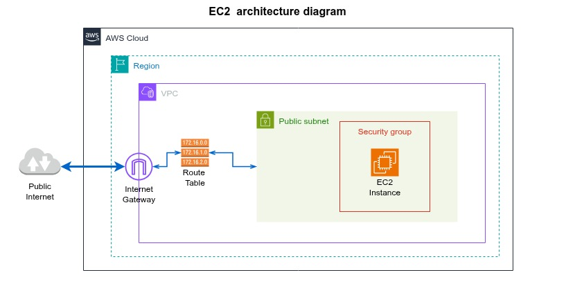
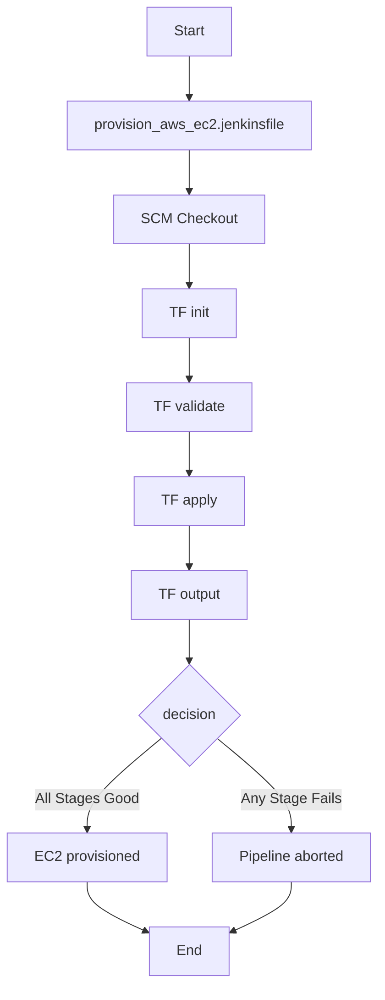

# Provisioning an EC2 instance using CI/CD 

This project is a demo of provisioning an EC2 instance (VM) on the AWS platform using a Jenkins Pipeline and Terraform.

## Architecture diagram



### Provisioning process

The **stages** executed by the **Jenkins Pipeline** are described as follows:

1. The Jenkins file [provision_aws_ec2.jenkinsfile](/aws/jenkinsfiles/provision_aws_ec2.jenkinsfile) is launched from the Jenkins Console.

2. The pipeline starts checking out the code from [this](https://github.com/ansalazadevops/iac-terraform) GitHub repository.

3. Using HCL scripts, the process executes the Terraform commands:
    - `init`,
    - `validate`,
    - `apply`,
    - `output`

4. If any pipeline stage fails, the process is aborted, and the infrastructure is not provisioned. Otherwise, the provisioning is completed.



The list of resources provisioned is as follows:

- Virtual Private Cloud. (VPC)
- Internet Gateway. (IGW)
- Route Table. (RTB)
- Public Subnet.
- Security groups:
    - HTTP for port 80.
    - SSH for port 22.
- EC2 Instance.

## About changes tracking and the Terraform State

The Jenkins instance runs in a Docker container with persistent volumes. There is a risk of losing the current Terraform state file if the Docker volume is removed or the image gets rebuilt.

As a result, to keep the Terraform State file safely, it must be held in a backend S3 Bucket.

For this example, the S3 Backend has been created manually using AWS CLI.

### Steps to create the AWS S3 Bucket Backend.

- Export the environment variables:

```bash
export BUCKET="<your S3 Bucket namne>"
export REGION="<the AWS default region>"
```

- Create the AWS S3 bucket using the AWS CLI.

```bash
# must be globally unique
# us-east-1 is the one region that must NOT pass LocationConstraint
aws s3api create-bucket --bucket "$BUCKET" --region "$REGION"
```

- Enable file versioning on the S3 bucket.

```bash
aws s3api put-bucket-versioning \
--bucket "$BUCKET" \
--versioning-configuration Status=Enabled
```

- Set up the Bucket Encryption.

```bash
aws s3api put-bucket-encryption \
--bucket "$BUCKET" \
--server-side-encryption-configuration \
'{"Rules":[{"ApplyServerSideEncryptionByDefault":{"SSEAlgorithm":"AES256"}}]}'
```

- Allow file locking to prevent two or more processes from modifying the Terraform State file simultaneously.

```bash
aws s3api put-public-access-block \
--bucket "$BUCKET" \
--public-access-block-configuration \
BlockPublicAcls=true,IgnorePublicAcls=true,BlockPublicPolicy=true,RestrictPublicBuckets=true
```

